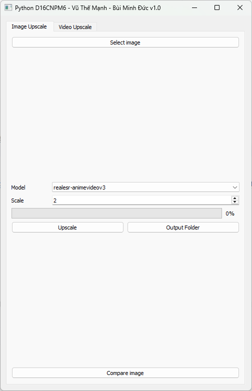

# **UpscaleAnime - VŨ THẾ MẠNH - BÙI MINH ĐỨC - D16CNPM6**
### Chức năng upscale video sẽ sớm được cập nhật.

## Mô tả

**UpscaleAnime** là một công cụ nâng cấp (upscale) hình ảnh, chủ yếu dành cho các hình ảnh anime, sử dụng mô hình **Real-ESRGAN**. Công cụ này sử dụng thuật toán học sâu để cải thiện chất lượng hình ảnh, giúp tăng độ phân giải mà không làm mất đi các chi tiết hoặc gây ra hiện tượng nhòe hình.

### Các tính năng chính:

- **Nâng cấp hình ảnh (Upscale Images):** Tăng độ phân giải của hình ảnh anime mà không làm mất chi tiết.
- **Hỗ trợ nhiều định dạng ảnh:** Bao gồm các định dạng phổ biến như **JPG**, **PNG**, và **WebP**.
- **Tùy chọn mô hình:** Có thể chọn giữa các mô hình khác nhau để nâng cấp hình ảnh, bao gồm các mô hình dành cho video và anime.
- **Cung cấp nhiều tùy chọn về tỷ lệ phóng to:** Từ x2, x3, đến x4, với khả năng tùy chỉnh theo nhu cầu người dùng.

### Yêu cầu hệ thống:

- **Hệ điều hành:** Windows
- **CUDA:** Cần GPU hỗ trợ CUDA (NVIDIA) cho hiệu suất tốt nhất.
- **Bộ xử lý:** Bộ xử lý đa nhân để xử lý song song.
- **RAM:** Tối thiểu 4GB RAM, khuyến nghị 8GB.

## Yêu cầu

- Python 3.x
- Thư viện: `subprocess`, `re`, `PyQt5`, `ffmpeg`, `video-compare`
- **Real-ESRGAN portable** [Real-ESRGAN-ncnn-vulkan](https://github.com/xinntao/Real-ESRGAN-ncnn-vulkan).
- GPU hỗ trợ CUDA (tuỳ chọn nhưng khuyến nghị để tăng tốc).

## Cài đặt

1. **Clone dự án**:

   ```bash
   git clone https://github.com/yourusername/UpscaleAnime.git
   cd UpscaleAnime
   ```
   
2. **Cài đặt các thư viện Python cần thiết**:

   Các file cần thiết đã bao gồm trong project, không cần làm gì thêm.

## Cấu trúc thư mục

```
UpscaleAnime/
├── bin/                    # Thư mục chứa các file execute (.exe)
│   └── models/             # Chứa các model upscale (không có máy train model, sử dụng model train sẵn)
├── Images/                 # Thư mục chứa các hình ảnh test
├── Model/                  # Đối tượng trong ứng dụng
├── Utilities/              # Dùng chung cho dự án
├── Windows/                # Chứa giao diện chương trình, sử dụng PyQT5 (gồm .ui và .py)
├── Main.py                 # Entry point
└── README.md               # Tài liệu dự án
```
## Cách sử dụng

### 1. Cấu hình

### Tab Image và Video tương tự nhau
Cấu hình đầu vào cho các tham số của việc nâng cấp hình ảnh trong **Config**. Cần cung cấp các thông tin:

- **Input File**: Đường dẫn đến tệp hình ảnh đầu vào.
- **Scale**: Tỉ lệ nâng cấp (ví dụ: 2, 3, 4 tuỳ vào model).
- **Model**: Mô hình sử dụng (ví dụ: `realesr-animevideov3`).

### Quy tắc file đầu ra: **[tên hình ảnh cũ]_x[Scale].[định dạng]**
### 2. Quá trình nâng cấp

Khi nhấn nút **Upscale**, công cụ sẽ bắt đầu quá trình nâng cấp hình ảnh. Trong suốt quá trình này, thông tin tiến trình sẽ được hiển thị qua thanh tiến trình (progress bar).

### 3. Cập nhật giao diện người dùng (UI)

Khi thực hiện nâng cấp, một thông báo sẽ được hiển thị để cho người dùng biết rằng tệp đầu ra đã tồn tại. Nếu tệp đã có, bạn có thể chọn tiếp tục hoặc hủy bỏ quá trình.

### 4. So sánh

Lựa chọn **Output Folder** sau khi upscale để mở thư mục chứa hình ảnh.
Ứng dụng đã tích hợp chức năng so sánh ảnh input và ảnh output. Khi upscale hoàn tất, lựa chọn **Compare Image** để so sánh hình ảnh.


## Ví dụ

### Khởi chạy ứng dụng

Để chạy ứng dụng, gọi `Main.py` từ dòng lệnh:
```bash
python main.py
```
Ứng dụng sẽ mở cửa sổ giao diện người dùng, nơi có thể chọn tệp hình ảnh đầu vào và cấu hình các tham số như tỉ lệ nâng cấp và mô hình. Tab Image Upscale và Video Upscale tương tự nhau



Chọn bức ảnh (có thể lấy ảnh mẫu trong Images), ảnh sẽ hiển thị preview ngoài form


Điều chỉnh model, scale cho phù hợp. Sau đó bấm **Upscale** để chạy, trạng thái sẽ hiển thị trên Progressbar


Sau khi có output, có thể bấm **Compare Image** Để so sánh chi tiết hơn. Ảnh bên trái là ảnh gốc, bên phải là sau xử lý, cách nhau bằng đường thẳng.


- **GPU**: Cần cài CUDA theo [**hướng dẫn**](https://github.com/xinntao/Real-ESRGAN-ncnn-vulkan?tab=readme-ov-file#full-usages) (nếu cần thiết).
- **Video**: Chức năng upscale video sẽ sớm được cập nhật.
---

**Copyright © TalonEzio - Duke - BoDoiIT6!**
